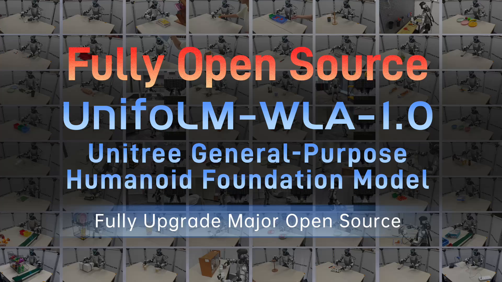

# UnifoLM-WLA-1.0

<a href="README.md"><kbd>English</kbd></a> | <a href="README_zh.md"><kbd>简体中文</kbd></a>

[Project Page](https://unigen-x.github.io/unifolm-wla.github.io/) | [Models](https://huggingface.co/collections/unitreerobotics/unifolm-wla-10) | [Datasets](https://huggingface.co/collections/unitreerobotics/unifolm-wla-10)

  

UnifoLM-WLA-1.0 is Unitree Robotics' comprehensively upgraded, next-generation general-purpose humanoid robot foundation model with 6B parameters. Built on large-scale general multimodal perception and understanding data and interaction-centric world modeling, it substantially advances spatial perception and understanding, achieving leading results across multiple embodied reasoning benchmarks. Trained on approximately 2,500 hours of high-quality real-robot data, a single model coordinates 64 tasks spanning desktop manipulation and whole-body manipulation. It supports two-finger grippers and multiple five-finger dexterous hands, with strong generalization across tasks and end effectors.

## 🔥 News

- Sep 11, 2026: 🚀 we released the model weights of [UnifoLM-ER-1](https://huggingface.co/unitreerobotics/UnifoLM-ER-1)
- Sep 11, 2026: 🚀 we released the model weights of [UnifoLM-ER-Flow](https://huggingface.co/unitreerobotics/UnifoLM-ER-Flow)

## 📑 Open-Source Plan

- **Code**
  - [ ] Post-Train Code
- **Models**
  - [x] [**UnifoLM-ER-1**](https://huggingface.co/unitreerobotics/UnifoLM-ER-1)
  - [x] [**UnifoLM-ER-Flow**](https://huggingface.co/unitreerobotics/UnifoLM-ER-Flow)
  - [ ] UnifoLM-WLA-Base
- **Datasets**
  - [x] [**UniBot-V1 Challenge Dataset**]([https://huggingface.co/collections/unitreerobotics/unibot-v1-challenge](https://huggingface.co/collections/unitreerobotics/unibot-v1-challenge-dataset))
  - [ ] Unitree-WBT-Dataset
  - [ ] Unitree-Manipulation-Dataset

## 📘 Technical Documentation

- [Robot Action, State, and Statistics Processing Specification](docs/robot_action_state_processing_en.md)
