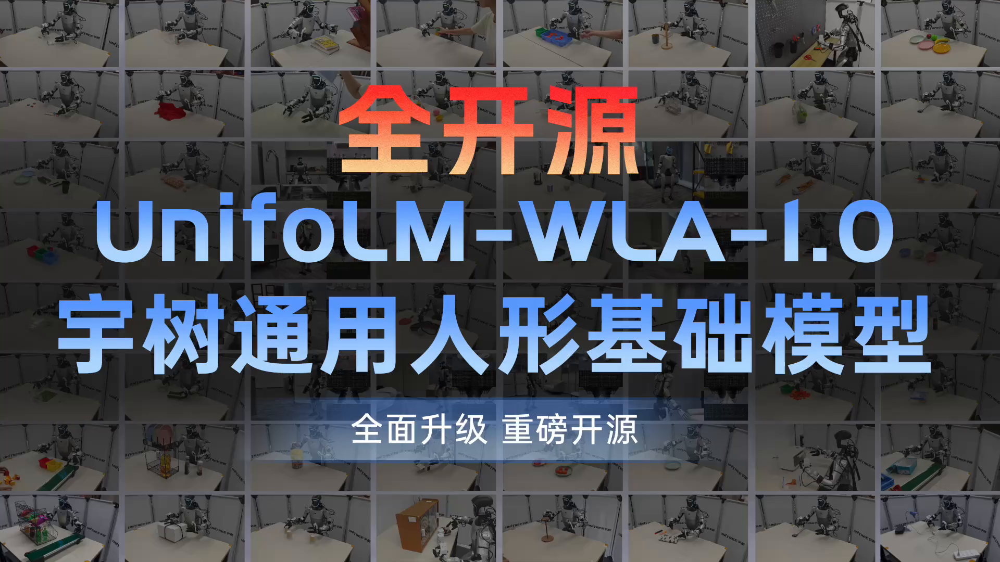

# UnifoLM-WLA-1.0

[项目主页](https://unigen-x.github.io/unifolm-wla.github.io/) | [模型](https://huggingface.co/collections/unitreerobotics/unifolm-wla-10) | [数据集](https://huggingface.co/collections/unitreerobotics/unifolm-wla-10)

  

UnifoLM-WLA-1.0 是宇树科技全面升级的新一代通用人形机器人基础模型，拥有 6B 参数。模型依托大规模通用多模态感知与理解数据，融合以交互为中心的世界建模，全面提升空间感知与理解能力，在多项具身推理评测中达到业界领先。通过约 2,500 小时高质量真机数据训练，单模型统筹64个任务，覆盖桌面操作与全身移动操作，适配二指夹爪及多种五指灵巧手，具备跨任务、跨末端执行器的泛化能力。

## 📘 技术文档

- [机器人动作、状态与统计量处理说明](docs/robot_action_state_processing.md)

## 🔥 新闻

- 2026年9月11日：🚀 我们发布了模型权重 [UnifoLM-ER-1](https://huggingface.co/unitreerobotics/UnifoLM-ER-1)
- 2026年9月11日：🚀 我们发布了模型权重 [UnifoLM-ER-Flow](https://huggingface.co/unitreerobotics/UnifoLM-ER-Flow)

## 📑 开源计划

- **代码**
  - [ ] 后训练代码
- **模型**
  - [x] [**UnifoLM-ER-1**](https://huggingface.co/unitreerobotics/UnifoLM-ER-1)
  - [x] [**UnifoLM-ER-Flow**](https://huggingface.co/unitreerobotics/UnifoLM-ER-Flow)
  - [ ] UnifoLM-WLA-Base
- **数据集**
  - [x] [**UniBot-V1 Challenge Dataset**](https://huggingface.co/collections/unitreerobotics/unibot-v1-challenge)
  - [ ] Unitree-WBT-Dataset
  - [ ] Unitree-Manipulation-Dataset
